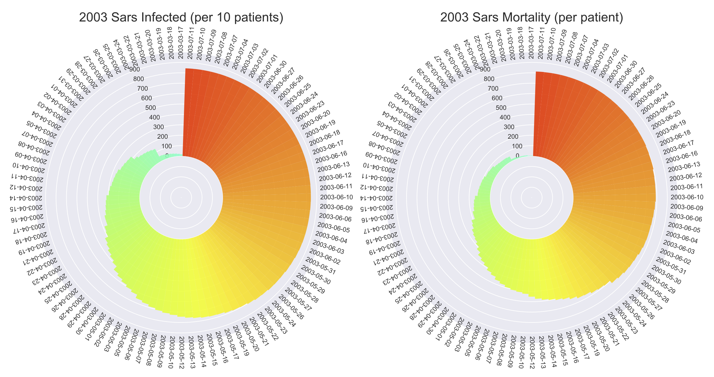

# 2003 SARS Virus Graph
Data Analytics project using NumPy and Matplotlib to make graphs representing the infected and mortality of the 2003 SARS outbreak in the first 96 days. This code is made specifically for Python 3.6 and later, and the data set _"sars_final.xlsx"_ can be found in __assets__ folder.

## Download Numpy and Matplotlib
To use the code, go to your _terminal_ or _command prompt_ and ensure you have Matplotlib and Numpy downloaded:  
`pip install numpy`
`pip install matplotlib`
`pip install pandas`  
  
Alternatively you can use the requirements.txt I have provided:  
`pip install -r requirements.txt`

## Here's what you should see

